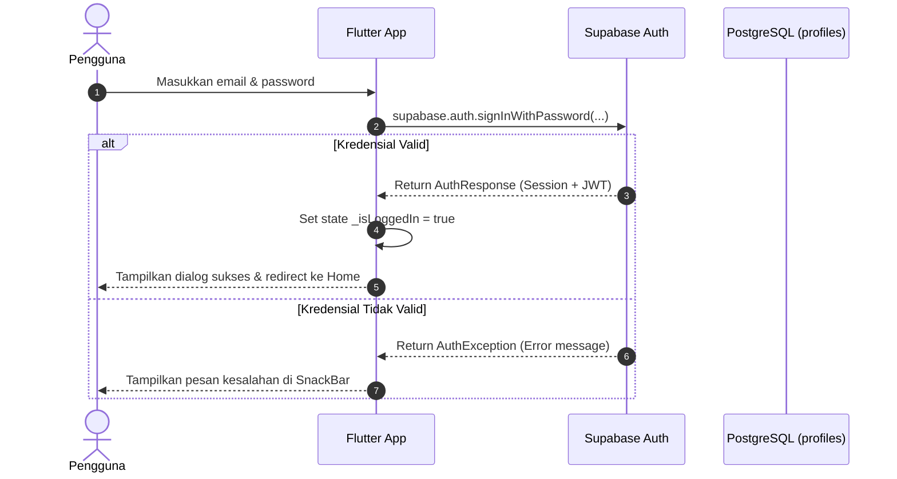

# 🗄️ Dokumentasi Backend (Supabase)

Dokumen ini menjelaskan arsitektur backend, konfigurasi layanan **Supabase (Backend-as-a-Service)**, autentikasi pengguna, dan integrasi API pada aplikasi **Katalog**.

---

## 1. ⚙️ Ringkasan Layanan Backend

Aplikasi Katalog memanfaatkan platform cloud **Supabase** yang menyediakan:
- **PostgreSQL Database**: Penyimpanan data relasional berkinerja tinggi untuk produk, kategori, keranjang, dan transaksi.
- **Supabase Auth**: Manajemen pengguna (registrasi, login dengan email/password, session JWT).
- **Row Level Security (RLS)**: Kontrol akses berbasis baris data langsung di tingkat database PostgreSQL.
- **Supabase Storage**: Penyimpanan objek cloud untuk file gambar sangkar kayu jati.

---

## 2. 🔑 Konfigurasi Proyek

Konfigurasi koneksi Supabase didefinisikan pada file [lib/supabase_config.dart](file:///d:/Tugas/katalog/lib/supabase_config.dart):

```dart
class SupabaseConfig {
  static const String supabaseUrl = 'https://yakrixngwazvoriwuzoe.supabase.co';
  static const String supabaseAnonKey = '<SUPABASE_ANON_PUBLIC_KEY>';
}

final supabase = Supabase.instance.client;
```

### Inisialisasi di Flutter (`lib/main.dart`):
```dart
await Supabase.initialize(
  url: SupabaseConfig.supabaseUrl,
  publishableKey: SupabaseConfig.supabaseAnonKey,
);
```

---

## 3. 🔐 Autentikasi Pengguna (Supabase Auth)

Aplikasi telah mengintegrasikan fungsi autentikasi email & kata sandi pada [lib/pages/login_page.dart](file:///d:/Tugas/katalog/lib/pages/login_page.dart).

### Alur Autentikasi:


### Contoh Pemanggilan Auth di Kode:
```dart
// Login
final response = await supabase.auth.signInWithPassword(
  email: emailController.text.trim(),
  password: passwordController.text,
);

// Cek Pengguna Aktif
final currentUser = supabase.auth.currentUser;

// Logout
await supabase.auth.signOut();
```

---

## 4. 🚀 Integrasi Data Katalog (CRUD)

Untuk mengambil daftar produk langsung dari database Supabase (menggantikan data statis):

```dart
Future<List<Product>> fetchProducts() async {
  final List<dynamic> data = await supabase
      .from('produk')
      .select()
      .order('created_at', ascending: false);

  return data.map((item) => Product.fromMap(item)).toList();
}
```

---

## 🔗 Dokumen Terkait
- [Struktur Skema Database & RLS Policy](./skema_database.md)
