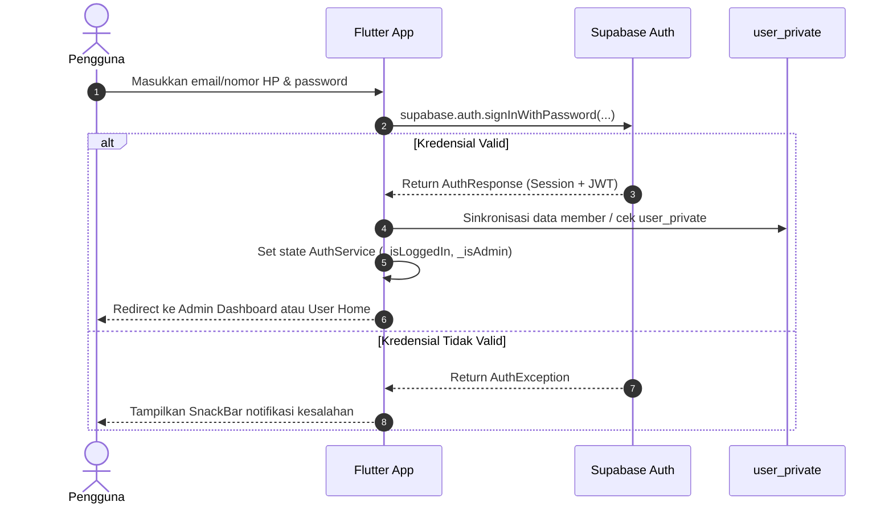

# 🗄️ Dokumentasi Backend (Supabase)

Dokumen ini menjelaskan arsitektur backend, konfigurasi layanan **Supabase (Backend-as-a-Service)**, autentikasi pengguna, penyimpanan file/pengaturan (Storage), dan integrasi API pada aplikasi **Katalog**.

---

## 1. ⚙️ Ringkasan Layanan Backend

Aplikasi Katalog memanfaatkan platform cloud **Supabase** yang menyediakan:
- **PostgreSQL Database (8 Tabel Inti Aktif)**:
  1. `produk`: Katalog produk sangkar publik beserta variasi bentuk sangkar (JSONB).
  2. `produk_custom`: Katalog desain custom khusus milik member/user tertentu.
  3. `user_private`: Rekap akun member, kredensial, dan penghitung request desain custom.
  4. `pesanan`: Tracking pesanan 4 tahap pengerjaan, rincian barang belanjaan (JSONB `items`), kontak pemesan, dan riwayat pesanan selesai.
  5. `bentuk_sangkar`: Master varian bentuk & ukuran sangkar tersimpan mandiri baris per baris (`id`, `name`, `image_url`, `created_at`).
  6. `app_settings`: Pengaturan toko global tersentralisasi di database (`id: global_settings`, `settings_json`: banner, logo, WA, navbar, font).
  7. `hashtags`: Database kamus tagar (#) terpusat untuk auto-complete cepat dan auto-harvesting tagar baru (`id`, `name`, `use_count`).
  8. `production_schedules`: Jadwal proses pembuatan sangkar bertingkat enterprise dengan format antarmuka 5 mode tampilan Notion-style (`id`, `title`, `category`, `start_date`, `end_date`, `status`, `image_url`, `notes`).
- **Supabase Auth**: Manajemen sesi login akun pengguna dan administrator.
- **Supabase Storage**:
  - Bucket `katalog`: Menyimpan file gambar produk/sangkar dan file cadangan sinkronisasi (`app_settings.json`).
  - Bucket `schedules`: Menyimpan berkas foto jadwal produksi yang diunggah langsung dari perangkat pengguna (laptop/smartphone).
  - Bucket `products`: Menyimpan foto produk baru dan upload desain kustom.
- **Row Level Security (RLS)**: Kontrol akses keamanan langsung di tingkat baris database PostgreSQL.

---

## 2. 🔑 Konfigurasi Proyek

Konfigurasi koneksi Supabase didefinisikan pada file [lib/supabase_config.dart](file:///d:/Tugas/katalog/lib/supabase_config.dart):

```dart
class SupabaseConfig {
  static const String supabaseUrl = 'https://yakrixngwazvoriwuzoe.supabase.co';
  static const String supabaseAnonKey = '<SUPABASE_ANON_PUBLIC_KEY>';
}

final supabase = Supabase.instance.client;
```

### Inisialisasi di Flutter (`lib/main.dart`):
```dart
await Supabase.initialize(
  url: SupabaseConfig.supabaseUrl,
  publishableKey: SupabaseConfig.supabaseAnonKey,
);
```

---

## 3. 🔐 Autentikasi Pengguna & Role

Aplikasi mengintegrasikan autentikasi pada [lib/pages/login_page.dart](file:///d:/Tugas/katalog/lib/pages/login_page.dart) dengan manajemen status terpusat melalui [lib/services/auth_service.dart](file:///d:/Tugas/katalog/lib/services/auth_service.dart).

- **Administrator**: Akun dengan email berawalan/memuat `admin` (misal: `admin@gmail.com`) diarahkan langsung ke `AdminDashboardPage`.
- **Member**: Pengguna terdaftar diarahkan ke `UserHomePage` (beranda katalog kustom & request gambar logo).
- **Tamu (Guest)**: Tetap dapat mengakses katalog umum publik tanpa hambatan login.

### Alur Autentikasi:


---

## 4. 🚀 Integrasi Service Layer & Query Supabase

Seluruh interaksi data dilakukan melalui arsitektur Service berbasis `ChangeNotifier`:

### A. Katalog Produk Publik (`ProductService`)
```dart
// Fetch produk dari tabel 'produk'
final List<dynamic> data = await supabase
    .from('produk')
    .select()
    .order('created_at', ascending: false);
```

### B. Pesanan Masuk & Tracking Tahap Produksi (`OrderService`)
```dart
// Insert pesanan baru dari keranjang checkout WhatsApp
await supabase.from('pesanan').insert({
  'customer_name': order.customerName,
  'phone': order.phone,
  'email': order.email,
  'order_date': dateStr,
  'status': 'Tahap 1',
  'stage_number': 1,
  'is_completed': false,
  'items': itemsPayload, // Array JSONB
});
```

### C. Member & Produk Custom (`UserService`)
```dart
// Registrasi member baru dengan nama lengkap
await supabase.from('user_private').insert({
  'name': name,
  'phone': phone,
  'email': email,
  'password': password,
  'join_date': dateStr,
});

// Fetch member private & produk custom
final userRows = await supabase.from('user_private').select();
final customProdRows = await supabase.from('produk_custom').select();
```

### D. Pengaturan Toko & Konfigurasi Global (`AppSettingsService`)
```dart
// Baca pengaturan toko langsung dari tabel 'app_settings'
final dbResult = await supabase
    .from('app_settings')
    .select('settings_json')
    .eq('id', 'global_settings')
    .maybeSingle();

// Upsert pengaturan toko
await supabase.from('app_settings').upsert({
  'id': 'global_settings',
  'settings_json': currentSettings,
  'updated_at': DateTime.now().toIso8601String(),
});
```

### E. Varian Bentuk Sangkar Mandiri Per Baris (`CageService`)
```dart
// Fetch seluruh variasi bentuk sangkar dari tabel 'bentuk_sangkar'
final rows = await supabase
    .from('bentuk_sangkar')
    .select()
    .order('created_at', ascending: true);

// Tambah/Update bentuk sangkar baris per baris
await supabase.from('bentuk_sangkar').upsert({
  'id': cage.id,
  'name': cage.name,
  'image_url': cage.imageUrl ?? '',
});

// Hapus bentuk sangkar berdasarkan ID
await supabase.from('bentuk_sangkar').delete().eq('id', cageId);
```

### F. Database Tagar Terpusat & Auto-Complete (`HashtagService`)
```dart
// Fetch kamus hashtag dari database terpusat
final rows = await supabase
    .from('hashtags')
    .select('name')
    .order('use_count', ascending: false);

// Auto-harvest hashtag baru saat disimpan
await supabase.from('hashtags').upsert({
  'name': cleanTag,
  'updated_at': DateTime.now().toIso8601String(),
}, onConflict: 'name');
```

### G. Jadwal Proses Produksi Multi-View Notion-Style (`ProductionScheduleService`)
```dart
// Fetch daftar jadwal produksi
final rows = await supabase
    .from('production_schedules')
    .select()
    .order('start_date', ascending: true);

// Tambah/Update item jadwal produksi dengan foto wajib
await supabase.from('production_schedules').upsert({
  'id': item.id,
  'title': item.title,
  'category': item.category,
  'start_date': item.startDate.toIso8601String().split('T').first,
  'end_date': item.endDate.toIso8601String().split('T').first,
  'status': item.status,
  'image_url': item.imageUrl,
  'notes': item.notes,
  'updated_at': DateTime.now().toIso8601String(),
});

// Hapus item jadwal
await supabase.from('production_schedules').delete().eq('id', id);
```

### H. Unggah Berkas & Storage (`StorageService`)
```dart
// Unggah file foto langsung dari memori/perangkat pengguna
final String path = 'schedules/${DateTime.now().millisecondsSinceEpoch}_$fileName';
await supabase.storage.from('schedules').uploadBinary(path, fileBytes);

// Dapatkan Public URL instan
final publicUrl = supabase.storage.from('schedules').getPublicUrl(path);
```

---

## 🔗 Dokumen Terkait
- [Struktur Skema Database & RLS Policy](./skema_database.md)

