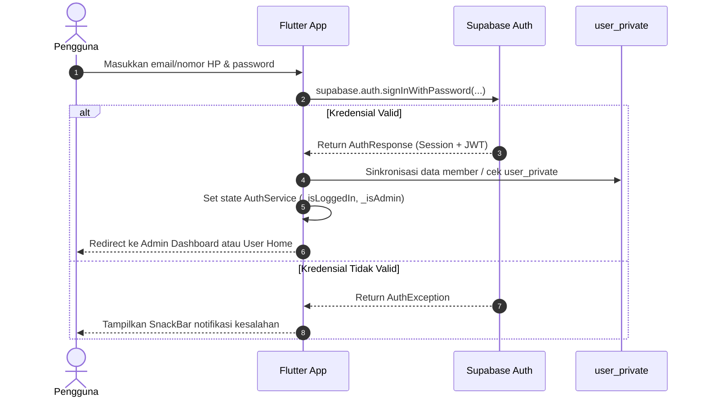

# 🗄️ Dokumentasi Backend (Supabase)

Dokumen ini menjelaskan arsitektur backend, konfigurasi layanan **Supabase (Backend-as-a-Service)**, autentikasi pengguna, penyimpanan file/pengaturan (Storage), dan integrasi API pada aplikasi **Katalog**.

---

## 1. ⚙️ Ringkasan Layanan Backend

Aplikasi Katalog memanfaatkan platform cloud **Supabase** yang menyediakan:
- **PostgreSQL Database (4 Tabel Inti)**:
  1. `produk`: Katalog produk sangkar publik beserta variasi bentuk sangkar (JSONB).
  2. `produk_custom`: Katalog desain custom khusus milik member/user tertentu.
  3. `user_private`: Rekap akun member, kredensial, dan penghitung request desain custom.
  4. `pesanan`: Tracking pesanan 4 tahap pengerjaan, rincian barang belanjaan (JSONB `items`), kontak pemesan, dan riwayat pesanan selesai.
- **Supabase Auth**: Manajemen sesi login akun pengguna dan administrator.
- **Supabase Storage**:
  - Bucket `katalog`: Menyimpan file gambar produk/sangkar dan konfigurasi global toko (`app_settings.json`).
- **Row Level Security (RLS)**: Kontrol akses keamanan langsung di tingkat baris database PostgreSQL.

---

## 2. 🔑 Konfigurasi Proyek

Konfigurasi koneksi Supabase didefinisikan pada file [lib/supabase_config.dart](file:///d:/Tugas/katalog/lib/supabase_config.dart):

```dart
class SupabaseConfig {
  static const String supabaseUrl = 'https://yakrixngwazvoriwuzoe.supabase.co';
  static const String supabaseAnonKey = '<SUPABASE_ANON_PUBLIC_KEY>';
}

final supabase = Supabase.instance.client;
```

### Inisialisasi di Flutter (`lib/main.dart`):
```dart
await Supabase.initialize(
  url: SupabaseConfig.supabaseUrl,
  publishableKey: SupabaseConfig.supabaseAnonKey,
);
```

---

## 3. 🔐 Autentikasi Pengguna & Role

Aplikasi mengintegrasikan autentikasi pada [lib/pages/login_page.dart](file:///d:/Tugas/katalog/lib/pages/login_page.dart) dengan manajemen status terpusat melalui [lib/services/auth_service.dart](file:///d:/Tugas/katalog/lib/services/auth_service.dart).

- **Administrator**: Akun dengan email berawalan/memuat `admin` (misal: `admin@gmail.com`) diarahkan langsung ke `AdminDashboardPage`.
- **Member**: Pengguna terdaftar diarahkan ke `UserHomePage` (beranda katalog kustom & request gambar logo).
- **Tamu (Guest)**: Tetap dapat mengakses katalog umum publik tanpa hambatan login.

### Alur Autentikasi:


---

## 4. 🚀 Integrasi Service Layer & Query Supabase

Seluruh interaksi data dilakukan melalui arsitektur Service berbasis `ChangeNotifier`:

### A. Katalog Produk Publik (`ProductService`)
```dart
// Fetch produk dari tabel 'produk'
final List<dynamic> data = await supabase
    .from('produk')
    .select()
    .order('created_at', ascending: false);
```

### B. Pesanan Masuk & Tracking Tahap Produksi (`OrderService`)
```dart
// Insert pesanan baru dari keranjang checkout WhatsApp
await supabase.from('pesanan').insert({
  'phone': order.phone,
  'email': order.email,
  'order_date': dateStr,
  'status': 'Tahap 1',
  'stage_number': 1,
  'is_completed': false,
  'items': itemsPayload, // Array JSONB
});
```

### C. Member & Produk Custom (`UserService`)
```dart
// Fetch member private & produk custom
final userRows = await supabase.from('user_private').select();
final customProdRows = await supabase.from('produk_custom').select();
```

### D. Pengaturan Toko & Gambar (`SettingsService`)
```dart
// Download konfigurasi toko dari Storage bucket 'katalog'
final bytes = await supabase.storage.from('katalog').download('app_settings.json');
```

---

## 🔗 Dokumen Terkait
- [Struktur Skema Database & RLS Policy](./skema_database.md)

