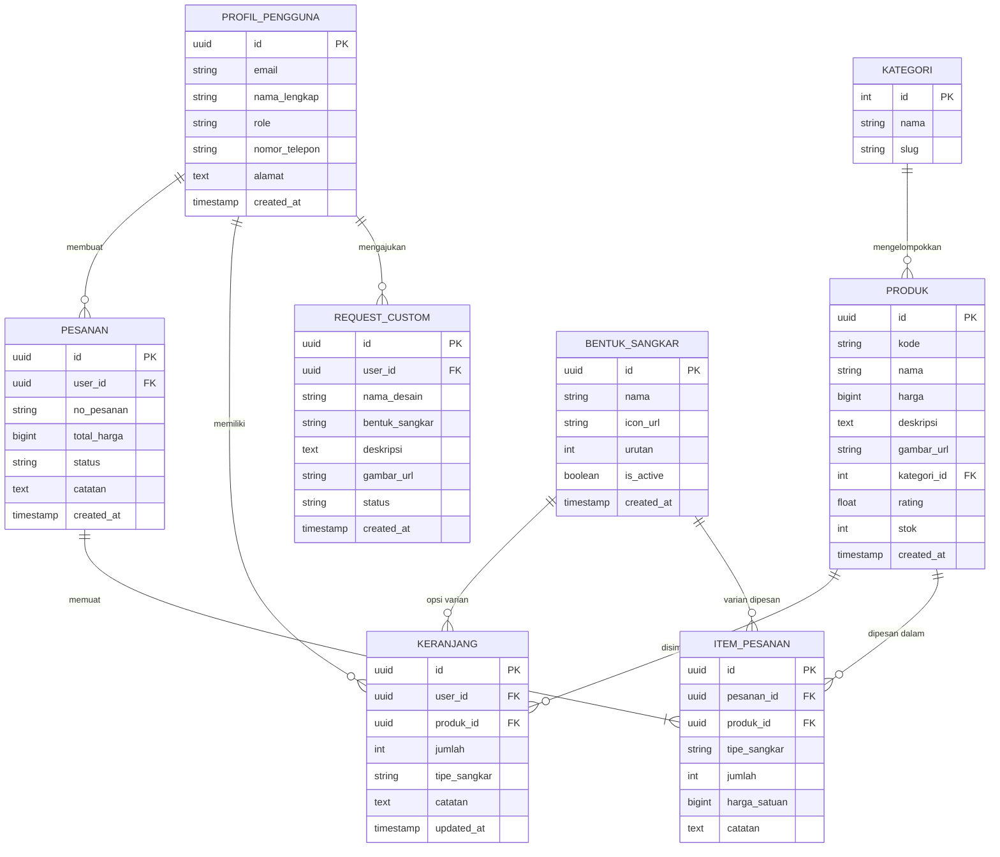

# 🗄️ Skema Database & Keamanan (PostgreSQL Supabase)

Dokumen ini mendefinisikan rancangan struktur tabel basis data relasional, tipe data, relasi (foreign keys), serta konfigurasi Row Level Security (RLS) di Supabase.

---

## 1. 🗂️ Diagram Relasi Entitas (ERD)



---

## 2. 📝 Skrip DDL PostgreSQL (SQL Schema)

Skrip SQL berikut dapat langsung dijalankan pada menu **SQL Editor** di Dashboard Supabase:

```sql
-- 1. Tabel Kategori Produk
CREATE TABLE public.kategori (
    id SERIAL PRIMARY KEY,
    nama VARCHAR(100) NOT NULL UNIQUE,
    slug VARCHAR(100) NOT NULL UNIQUE
);

-- 2. Tabel Produk Sangkar
CREATE TABLE public.produk (
    id UUID DEFAULT gen_random_uuid() PRIMARY KEY,
    kode VARCHAR(50),
    nama VARCHAR(255) NOT NULL,
    harga BIGINT NOT NULL DEFAULT 0,
    deskripsi TEXT,
    gambar_url TEXT,
    kategori_id INT REFERENCES public.kategori(id) ON DELETE SET NULL,
    rating NUMERIC(3, 2) DEFAULT 4.8,
    stok INT NOT NULL DEFAULT 0,
    created_at TIMESTAMP WITH TIME ZONE DEFAULT timezone('utc'::text, now()) NOT NULL
);

-- 3. Tabel Bentuk Sangkar (Dinamis dari Dashboard Admin)
CREATE TABLE public.bentuk_sangkar (
    id UUID DEFAULT gen_random_uuid() PRIMARY KEY,
    nama VARCHAR(100) NOT NULL,
    icon_url TEXT,
    urutan INT DEFAULT 0,
    is_active BOOLEAN DEFAULT true,
    created_at TIMESTAMP WITH TIME ZONE DEFAULT timezone('utc'::text, now()) NOT NULL
);

-- 4. Tabel Profil Pengguna (Sinkronisasi dengan auth.users & role admin/member)
CREATE TABLE public.profil_pengguna (
    id UUID PRIMARY KEY REFERENCES auth.users(id) ON DELETE CASCADE,
    email VARCHAR(255) NOT NULL,
    nama_lengkap VARCHAR(255),
    role VARCHAR(50) DEFAULT 'member' NOT NULL, -- 'member' atau 'admin'
    nomor_telepon VARCHAR(20),
    alamat TEXT,
    created_at TIMESTAMP WITH TIME ZONE DEFAULT timezone('utc'::text, now()) NOT NULL
);

-- 5. Tabel Keranjang Belanja
CREATE TABLE public.keranjang (
    id UUID DEFAULT gen_random_uuid() PRIMARY KEY,
    user_id UUID REFERENCES public.profil_pengguna(id) ON DELETE CASCADE NOT NULL,
    produk_id UUID REFERENCES public.produk(id) ON DELETE CASCADE NOT NULL,
    jumlah INT NOT NULL DEFAULT 1,
    tipe_sangkar VARCHAR(100),
    catatan TEXT,
    updated_at TIMESTAMP WITH TIME ZONE DEFAULT timezone('utc'::text, now()) NOT NULL
);

-- 6. Tabel Request Desain Sangkar & Logo Custom (User Private)
CREATE TABLE public.request_custom (
    id UUID DEFAULT gen_random_uuid() PRIMARY KEY,
    user_id UUID REFERENCES public.profil_pengguna(id) ON DELETE CASCADE NOT NULL,
    nama_desain VARCHAR(255) NOT NULL,
    bentuk_sangkar VARCHAR(100),
    gambar_url TEXT, -- Referensi gambar desain/motif yang di-insert user
    deskripsi TEXT,
    status VARCHAR(50) DEFAULT 'menunggu_konfirmasi' NOT NULL, -- 'menunggu_konfirmasi', 'diproses', 'selesai'
    created_at TIMESTAMP WITH TIME ZONE DEFAULT timezone('utc'::text, now()) NOT NULL
);

-- 7. Tabel Pesanan (Mendukung 4 Tahap Produksi & Riwayat Selesai)
CREATE TABLE public.pesanan (
    id UUID DEFAULT gen_random_uuid() PRIMARY KEY,
    user_id UUID REFERENCES public.profil_pengguna(id) ON DELETE CASCADE,
    no_pesanan VARCHAR(50) UNIQUE NOT NULL,
    total_harga BIGINT NOT NULL DEFAULT 0,
    status VARCHAR(50) DEFAULT 'Tahap 1' NOT NULL, -- 'Tahap 1' s/d 'Tahap 4', atau 'Selesai'
    current_step INT NOT NULL DEFAULT 1, -- 1: Verifikasi, 2: Kayu Jati, 3: Ukir, 4: Perakitan
    catatan TEXT,
    nomor_telepon VARCHAR(30) DEFAULT '085732257048',
    tanggal_selesai TIMESTAMP WITH TIME ZONE,
    created_at TIMESTAMP WITH TIME ZONE DEFAULT timezone('utc'::text, now()) NOT NULL
);

-- 8. Tabel Item Pesanan
CREATE TABLE public.item_pesanan (
    id UUID DEFAULT gen_random_uuid() PRIMARY KEY,
    pesanan_id UUID REFERENCES public.pesanan(id) ON DELETE CASCADE NOT NULL,
    produk_id UUID REFERENCES public.produk(id) ON DELETE SET NULL,
    nama_produk VARCHAR(255) NOT NULL,
    tipe_sangkar VARCHAR(100),
    gambar_url TEXT,
    jumlah INT NOT NULL DEFAULT 1,
    harga_satuan BIGINT NOT NULL DEFAULT 0,
    catatan TEXT
);

-- 9. Tabel Pengaturan Toko (Admin Settings)
CREATE TABLE public.pengaturan_toko (
    id INT PRIMARY KEY DEFAULT 1,
    admin_whatsapp VARCHAR(30) NOT NULL DEFAULT '085732257048',
    banner_image_url TEXT,
    navbar_style INT NOT NULL DEFAULT 1, -- Style 1, 2, atau 3
    font_family VARCHAR(50) NOT NULL DEFAULT 'Times New Roman',
    updated_at TIMESTAMP WITH TIME ZONE DEFAULT timezone('utc'::text, now()) NOT NULL,
    CONSTRAINT single_row CHECK (id = 1)
);
```

---

## 3. 🛡️ Kebijakan Keamanan (Row Level Security / RLS)

Supabase menggunakan RLS untuk membatasi akses data pada level baris:

```sql
-- Mengaktifkan RLS pada seluruh tabel
ALTER TABLE public.kategori ENABLE ROW LEVEL SECURITY;
ALTER TABLE public.produk ENABLE ROW LEVEL SECURITY;
ALTER TABLE public.bentuk_sangkar ENABLE ROW LEVEL SECURITY;
ALTER TABLE public.profil_pengguna ENABLE ROW LEVEL SECURITY;
ALTER TABLE public.keranjang ENABLE ROW LEVEL SECURITY;
ALTER TABLE public.request_custom ENABLE ROW LEVEL SECURITY;
ALTER TABLE public.pesanan ENABLE ROW LEVEL SECURITY;
ALTER TABLE public.item_pesanan ENABLE ROW LEVEL SECURITY;
ALTER TABLE public.pengaturan_toko ENABLE ROW LEVEL SECURITY;

-- 1. Kebijakan Produk, Kategori, & Bentuk Sangkar (Publik dapat melihat)
CREATE POLICY "Publik dapat melihat kategori" ON public.kategori FOR SELECT USING (true);
CREATE POLICY "Publik dapat melihat produk" ON public.produk FOR SELECT USING (true);
CREATE POLICY "Publik dapat melihat bentuk sangkar" ON public.bentuk_sangkar FOR SELECT USING (true);
CREATE POLICY "Publik dapat membaca pengaturan toko" ON public.pengaturan_toko FOR SELECT USING (true);

-- 1b. Kebijakan Admin untuk Pengaturan Toko
CREATE POLICY "Admin dapat mengubah pengaturan toko" ON public.pengaturan_toko
    FOR ALL USING (
        EXISTS (
            SELECT 1 FROM public.profil_pengguna
            WHERE id = auth.uid() AND role = 'admin'
        )
    );

-- 2. Kebijakan Admin untuk Bentuk Sangkar & Produk
CREATE POLICY "Admin dapat mengelola bentuk sangkar" ON public.bentuk_sangkar
    FOR ALL USING (
        EXISTS (
            SELECT 1 FROM public.profil_pengguna
            WHERE id = auth.uid() AND role = 'admin'
        )
    );

-- 3. Kebijakan Profil Pengguna
CREATE POLICY "Pengguna dapat mengelola profil sendiri" ON public.profil_pengguna
    FOR ALL USING (auth.uid() = id);

-- 4. Kebijakan Keranjang Belanja
CREATE POLICY "Pengguna dapat mengelola keranjang sendiri" ON public.keranjang
    FOR ALL USING (auth.uid() = user_id);

-- 5. Kebijakan Request Custom (User Private)
CREATE POLICY "Pengguna dapat melihat & mengajukan request miliknya" ON public.request_custom
    FOR ALL USING (auth.uid() = user_id);

CREATE POLICY "Admin dapat melihat seluruh request custom" ON public.request_custom
    FOR SELECT USING (
        EXISTS (
            SELECT 1 FROM public.profil_pengguna
            WHERE id = auth.uid() AND role = 'admin'
        )
    );

-- 6. Kebijakan Pesanan & Item Pesanan
CREATE POLICY "Pengguna dapat melihat pesanan sendiri" ON public.pesanan
    FOR SELECT USING (auth.uid() = user_id);

CREATE POLICY "Admin dapat mengelola seluruh pesanan" ON public.pesanan
    FOR ALL USING (
        EXISTS (
            SELECT 1 FROM public.profil_pengguna
            WHERE id = auth.uid() AND role = 'admin'
        )
    );
```

---

## 7. 📦 Pemetaan Penyimpanan Data Bentuk Sangkar di PostgreSQL Supabase

Untuk efisiensi querying dan fleksibilitas variasi dinamis, data bentuk sangkar disimpan pada struktur berikut:

| Konteks | Tabel Supabase | Nama Kolom / Field | Tipe Data | Contoh Nilai |
| :--- | :--- | :--- | :--- | :--- |
| **Daftar Variasi Sangkar pada Produk** | `public.produk` & `public.produk_custom` | `variasi` | `JSONB` (Array of Object) | `[{"id": "1", "name": "Sangkar 1", "imageUrl": ""}]` |
| **Pilihan Sangkar pada Pesanan Masuk & Riwayat** | `public.pesanan` | `items` -> `cage_type` | `JSONB` -> `VARCHAR` | `"Sangkar 1"`, `"Sangkar Segi Enam"` |
| **Tabel Master Entitas (Relasional)** | `public.bentuk_sangkar` | `nama`, `id`, `icon_url` | `UUID`, `VARCHAR` | `id: uuid`, `nama: "Sangkar 1"` |

