# 🗄️ Skema Database & Keamanan (PostgreSQL Supabase)

Dokumen ini mendefinisikan struktur tabel basis data relasional aktif, tipe data, pemanfaatan JSONB, serta konfigurasi Row Level Security (RLS) di Supabase yang terintegrasi langsung dengan kode aplikasi **Katalog (Jatimas Sangkar)**.

---

## 1. 💡 Arsitektur & Prinsip Penyederhanaan Database

Sebelumnya terdapat 14 tabel (termasuk tabel warisan template seperti `orders`, `order_items`, `carts`, `cart_items`, `logos`, `cage_shapes`, dll.). Basis data telah **disederhanakan dan dioptimalkan menjadi 4 tabel inti** berbasis pendekatan hibrida Relasional + JSONB:

1. **Efisiensi Transaksi & Variasi (JSONB)**:
   - Rincian variasi bentuk sangkar disimpan langsung di kolom `variasi` (`JSONB`) pada tabel `produk` dan `produk_custom`.
   - Rincian barang belanjaan dalam pesanan disimpan langsung di kolom `items` (`JSONB`) pada tabel `pesanan`. Hal ini mengeliminasi kebutuhan tabel relasi terpisah seperti `order_items` dan mempercepat proses query.
2. **Keranjang Belanja Sisi Klien (Local State & Direct WA Checkout)**:
   - Keranjang belanja tamu dan member dikelola di memori aplikasi/lokal klien secara instan, lalu langsung divalidasi ke WhatsApp Admin (`wa.me`) sehingga tabel `carts` dan `cart_items` tidak lagi membebani cloud database.
3. **Penyimpanan Pengaturan Toko (Cloud Object Storage)**:
   - Pengaturan toko (nomor WhatsApp admin, banner kustom, navbar style, font) disimpan dalam file `app_settings.json` di dalam Supabase Storage Bucket `katalog`.

---

## 2. 🗂️ Diagram Relasi Entitas (ERD) Aktif

```mermaid
erDiagram
    USER_PRIVATE ||--o{ PRODUK_CUSTOM : "memiliki desain kustom"
    USER_PRIVATE ||--o{ PESANAN : "melakukan transaksi"
    PRODUK ||--o{ PESANAN : "direferensikan dalam items (JSONB)"
    
    PRODUK {
        uuid id PK
        string kode
        string nama
        bigint harga
        text deskripsi
        text gambar_url
        string tagar
        int stok
        string last_edited_date
        jsonb variasi "Daftar bentuk sangkar [id, name, imageUrl]"
        timestamp created_at
    }

    PRODUK_CUSTOM {
        uuid id PK
        string user_identifier FK "Email / No HP Pemilik"
        string kode
        string nama
        bigint harga
        text deskripsi
        text gambar_url
        string kategori
        jsonb variasi "Bentuk sangkar terpilih"
        string last_edited_date
        timestamp created_at
    }

    USER_PRIVATE {
        uuid id PK
        string phone "Nomor Telepon Member"
        string email "Email Member"
        string password "Kredensial Akses"
        string join_date "Tanggal Bergabung"
        int jumlah_logo_custom "Total Desain Kustom"
        int request_count
        timestamp created_at
    }

    PESANAN {
        uuid id PK
        string phone "Nomor HP Pemesan"
        string email "Email Pemesan (opsional)"
        string order_date "Tanggal Order"
        string status "Tahap 1 s/d Tahap 4 / Selesai"
        int stage_number "1: Verifikasi, 2: Kayu, 3: Ukir, 4: Perakitan"
        boolean is_completed "Flag Pesanan Selesai"
        bigint total_amount "Total Harga"
        jsonb items "Array [product_name, quantity, cage_type, note, image_url]"
        timestamp created_at
    }

    BENTUK_SANGKAR {
        string id PK "cage_timestamp_seq"
        string name "Nama Ukuran / Bentuk Sangkar"
        text image_url "URL Foto Master Bentuk"
        timestamp created_at
    }

    APP_SETTINGS {
        string id PK "global_settings"
        jsonb settings_json "Konfigurasi Toko (logo, banner, wa, navbar, font)"
        timestamp updated_at
    }

    HASHTAGS {
        uuid id PK "gen_random_uuid()"
        string name UK "Nama Hashtag (#jati, #sangkar, dll)"
        int use_count "Frekuensi Penggunaan"
        timestamp created_at
        timestamp updated_at
    }

    PRODUCTION_SCHEDULES {
        uuid id PK "gen_random_uuid()"
        string title "Nama Proyek / Item Produksi"
        string category "Kategori Sangkar / Produk"
        date start_date "Tanggal Mulai Produksi"
        date end_date "Target Tanggal Selesai"
        string status "Direncanakan / Proses Produksi / Finishing / Selesai"
        text image_url "URL Foto Wajib (Storage/Base64/Network)"
        text notes "Catatan Tambahan & Progres"
        timestamp created_at
        timestamp updated_at
    }
```



---

## 3. 📝 Skrip DDL PostgreSQL (SQL Schema Produksi)

Skrip SQL berikut merupakan skema bersih resmi yang digunakan oleh aplikasi:

```sql
-- ==============================================================================
-- 1. TABEL PRODUK KATALOG PUBLIK
-- Dikelola oleh ProductService (Fetch publik, Tambah/Edit/Hapus oleh Admin)
-- ==============================================================================
CREATE TABLE IF NOT EXISTS public.produk (
    id UUID DEFAULT gen_random_uuid() PRIMARY KEY,
    kode VARCHAR(50) DEFAULT 'A01',
    nama VARCHAR(255) NOT NULL,
    harga BIGINT NOT NULL DEFAULT 0,
    deskripsi TEXT,
    gambar_url TEXT,
    tagar VARCHAR(255),
    stok INT NOT NULL DEFAULT 10,
    last_edited_date VARCHAR(50),
    variasi JSONB DEFAULT '[]'::jsonb,
    created_at TIMESTAMP WITH TIME ZONE DEFAULT timezone('utc'::text, now()) NOT NULL
);

-- ==============================================================================
-- 2. TABEL USER PRIVATE (AKUN & MEMBER CUSTOM)
-- Dikelola oleh UserService (Akun member, rekap request, profil)
-- ==============================================================================
CREATE TABLE IF NOT EXISTS public.user_private (
    id UUID DEFAULT gen_random_uuid() PRIMARY KEY,
    phone VARCHAR(30) DEFAULT '',
    email VARCHAR(255) DEFAULT '',
    password VARCHAR(255) DEFAULT 'user123',
    join_date VARCHAR(50),
    jumlah_logo_custom INT DEFAULT 0,
    request_count INT DEFAULT 0,
    created_at TIMESTAMP WITH TIME ZONE DEFAULT timezone('utc'::text, now()) NOT NULL
);

-- Index pencarian cepat berdasarkan telepon dan email
CREATE INDEX IF NOT EXISTS idx_user_private_phone ON public.user_private(phone);
CREATE INDEX IF NOT EXISTS idx_user_private_email ON public.user_private(email);

-- ==============================================================================
-- 3. TABEL PRODUK CUSTOM (KATALOG KHUSUS MEMBER)
-- Dikelola oleh UserService (Desain logo custom yang diajukan member)
-- ==============================================================================
CREATE TABLE IF NOT EXISTS public.produk_custom (
    id UUID DEFAULT gen_random_uuid() PRIMARY KEY,
    user_identifier VARCHAR(255) NOT NULL, -- Merujuk ke phone atau email pemilik
    kode VARCHAR(50) DEFAULT 'A01',
    nama VARCHAR(255) NOT NULL,
    harga BIGINT NOT NULL DEFAULT 0,
    deskripsi TEXT,
    gambar_url TEXT,
    kategori VARCHAR(100),
    variasi JSONB DEFAULT '[]'::jsonb,
    last_edited_date VARCHAR(50),
    created_at TIMESTAMP WITH TIME ZONE DEFAULT timezone('utc'::text, now()) NOT NULL
);

CREATE INDEX IF NOT EXISTS idx_produk_custom_user ON public.produk_custom(user_identifier);

-- ==============================================================================
-- 4. TABEL PESANAN (TRACKING 4 TAHAP PRODUKSI & RIWAYAT)
-- Dikelola oleh OrderService (Checkout WhatsApp, Tracking Member, Admin Detail)
-- ==============================================================================
CREATE TABLE IF NOT EXISTS public.pesanan (
    id UUID DEFAULT gen_random_uuid() PRIMARY KEY,
    phone VARCHAR(30) NOT NULL,
    email VARCHAR(255) DEFAULT '',
    order_date VARCHAR(50),
    status VARCHAR(50) DEFAULT 'Tahap 1' NOT NULL,
    stage_number INT DEFAULT 1 NOT NULL, -- 1 s/d 4 (Tahap Produksi), >=5 (Selesai)
    is_completed BOOLEAN DEFAULT false NOT NULL,
    total_amount BIGINT DEFAULT 0,
    items JSONB DEFAULT '[]'::jsonb NOT NULL,
    created_at TIMESTAMP WITH TIME ZONE DEFAULT timezone('utc'::text, now()) NOT NULL
);

CREATE INDEX IF NOT EXISTS idx_pesanan_phone ON public.pesanan(phone);
CREATE INDEX IF NOT EXISTS idx_pesanan_is_completed ON public.pesanan(is_completed);

-- ==============================================================================
-- 5. TABEL BENTUK SANGKAR (MASTER BENTUK SANGKAR MANDIRI PER BARIS)
-- Dikelola oleh CageService (Tambah/Hapus/Update dari Admin Dashboard)
-- Catatan Pembersihan: 8 item dummy lama dan duplikasi telah dibersihkan secara tuntas.
-- Data aktif saat ini terdiri dari 4 variasi riil: 'Replika', 'Kosan standard', 'Kosan Ceper', dan 'Tebok'.
-- Penghapusan dari admin dashboard dieksekusi secara asinkron (await) ke tabel ini dan disinkronkan ke cloud.
-- ==============================================================================
CREATE TABLE IF NOT EXISTS public.bentuk_sangkar (
    id VARCHAR(255) PRIMARY KEY,
    name VARCHAR(255) NOT NULL,
    image_url TEXT DEFAULT '',
    created_at TIMESTAMP WITH TIME ZONE DEFAULT timezone('utc'::text, now()) NOT NULL
);

-- ==============================================================================
-- 6. TABEL APP SETTINGS (PENGATURAN TOKO GLOBAL & ADMIN)
-- Dikelola oleh AppSettingsService (Logo, Banner, WhatsApp, Navbar, Font)
-- ==============================================================================
CREATE TABLE IF NOT EXISTS public.app_settings (
    id VARCHAR(255) PRIMARY KEY,
    settings_json JSONB NOT NULL DEFAULT '{}'::jsonb,
    updated_at TIMESTAMP WITH TIME ZONE DEFAULT timezone('utc'::text, now()) NOT NULL
);

-- ==============================================================================
-- 7. TABEL HASHTAGS (DATABASE HASHTAG UNTUK AUTO-COMPLETE PRODUK ADMIN)
-- Dikelola oleh HashtagService (Auto-complete, Auto-harvest, Sinkronisasi)
-- ==============================================================================
CREATE TABLE IF NOT EXISTS public.hashtags (
    id UUID DEFAULT gen_random_uuid() PRIMARY KEY,
    name VARCHAR(100) UNIQUE NOT NULL,
    use_count INT DEFAULT 1,
    created_at TIMESTAMP WITH TIME ZONE DEFAULT timezone('utc'::text, now()) NOT NULL,
    updated_at TIMESTAMP WITH TIME ZONE DEFAULT timezone('utc'::text, now()) NOT NULL
);

-- ==============================================================================
-- 8. TABEL PRODUCTION SCHEDULES (JADWAL PROSES PRODUKSI NOTION-STYLE)
-- Dikelola oleh ProductionScheduleService (Multi-view 5 Mode, CRUD, Foto Wajib)
-- ==============================================================================
CREATE TABLE IF NOT EXISTS public.production_schedules (
    id UUID DEFAULT gen_random_uuid() PRIMARY KEY,
    title VARCHAR(255) NOT NULL,
    category VARCHAR(100) DEFAULT 'Sangkar Jati',
    start_date DATE NOT NULL,
    end_date DATE NOT NULL,
    status VARCHAR(50) DEFAULT 'Proses Produksi',
    image_url TEXT NOT NULL,
    notes TEXT,
    created_at TIMESTAMP WITH TIME ZONE DEFAULT timezone('utc'::text, now()) NOT NULL,
    updated_at TIMESTAMP WITH TIME ZONE DEFAULT timezone('utc'::text, now()) NOT NULL
);
```

---

## 4. 🗄️ Supabase Storage Buckets

Aplikasi menggunakan beberapa **Storage Bucket** di Supabase untuk pengelolaan aset berkas:

1. **Bucket `katalog`**:
   - **`app_settings.json`**: Berisi file cadangan konfigurasi global toko (nomor WA, banner, navbar, font) dan persistensi offline yang dikelola oleh `AppSettingsService` dan `CageService`.
   - Menampung gambar produk katalog publik dan varian bentuk sangkar.
2. **Bucket `schedules`**:
   - Dikelola oleh `StorageService` untuk menampung gambar jadwal proses pembuatan yang diunggah langsung oleh pengguna dari laptop atau galeri handphone.
3. **Bucket `products`**:
   - Menampung foto produk baru dan upload desain kustom pengguna.

---

## 5. 🛡️ Kebijakan Keamanan (Row Level Security / RLS)

```sql
-- Mengaktifkan RLS pada seluruh tabel inti
ALTER TABLE public.produk ENABLE ROW LEVEL SECURITY;
ALTER TABLE public.user_private ENABLE ROW LEVEL SECURITY;
ALTER TABLE public.produk_custom ENABLE ROW LEVEL SECURITY;
ALTER TABLE public.pesanan ENABLE ROW LEVEL SECURITY;
ALTER TABLE public.bentuk_sangkar ENABLE ROW LEVEL SECURITY;
ALTER TABLE public.app_settings ENABLE ROW LEVEL SECURITY;
ALTER TABLE public.hashtags ENABLE ROW LEVEL SECURITY;
ALTER TABLE public.production_schedules ENABLE ROW LEVEL SECURITY;

-- 1. Kebijakan Produk Publik
CREATE POLICY "Publik dapat melihat produk" ON public.produk 
    FOR SELECT USING (true);
CREATE POLICY "Pengguna terautentikasi/anonim dapat mengelola produk" ON public.produk 
    FOR ALL USING (true);

-- 2. Kebijakan User Private
CREATE POLICY "Akses baca user_private" ON public.user_private 
    FOR SELECT USING (true);
CREATE POLICY "Akses tulis user_private" ON public.user_private 
    FOR ALL USING (true);

-- 3. Kebijakan Produk Custom
CREATE POLICY "Akses baca produk_custom" ON public.produk_custom 
    FOR SELECT USING (true);
CREATE POLICY "Akses kelola produk_custom" ON public.produk_custom 
    FOR ALL USING (true);

-- 4. Kebijakan Pesanan
CREATE POLICY "Akses baca pesanan" ON public.pesanan 
    FOR SELECT USING (true);
CREATE POLICY "Akses insert dan update pesanan" ON public.pesanan 
    FOR ALL USING (true);

-- 5. Kebijakan Bentuk Sangkar
CREATE POLICY "Akses penuh bentuk_sangkar" ON public.bentuk_sangkar 
    FOR ALL USING (true) WITH CHECK (true);
GRANT ALL ON TABLE public.bentuk_sangkar TO anon, authenticated;

-- 6. Kebijakan App Settings
CREATE POLICY "Akses penuh app_settings" ON public.app_settings 
    FOR ALL USING (true) WITH CHECK (true);
GRANT ALL ON TABLE public.app_settings TO anon, authenticated;

-- 7. Kebijakan Hashtags Terpusat
CREATE POLICY "Akses penuh hashtags" ON public.hashtags 
    FOR ALL USING (true) WITH CHECK (true);
GRANT ALL ON TABLE public.hashtags TO anon, authenticated;

-- 8. Kebijakan Jadwal Produksi (Production Schedules)
CREATE POLICY "Akses penuh production_schedules" ON public.production_schedules 
    FOR ALL USING (true) WITH CHECK (true);
GRANT ALL ON TABLE public.production_schedules TO anon, authenticated;
```

---

## 6. 🧹 Pembersihan Tabel Lama (Legacy Clean-Up)

Bagi database yang sebelumnya telah terbuat tabel bawaan template lama yang tidak lagi digunakan, pembersihan dapat dieksekusi dengan perintah SQL berikut (tabel aktif `produk`, `user_private`, `produk_custom`, `pesanan`, `bentuk_sangkar`, `app_settings`, `hashtags`, dan `production_schedules` tetap dipertahankan):

```sql
DROP TABLE IF EXISTS public.logo_hashtags CASCADE;
DROP TABLE IF EXISTS public.logos CASCADE;
DROP TABLE IF EXISTS public.cart_items CASCADE;
DROP TABLE IF EXISTS public.carts CASCADE;
DROP TABLE IF EXISTS public.order_items CASCADE;
DROP TABLE IF EXISTS public.orders CASCADE;
DROP TABLE IF EXISTS public.cage_shapes CASCADE;
DROP TABLE IF EXISTS public.private_requests CASCADE;
DROP TABLE IF EXISTS public.profiles CASCADE;
DROP TABLE IF EXISTS public.kategori CASCADE;
DROP TABLE IF EXISTS public.keranjang CASCADE;
DROP TABLE IF EXISTS public.request_custom CASCADE;
DROP TABLE IF EXISTS public.item_pesanan CASCADE;
```
