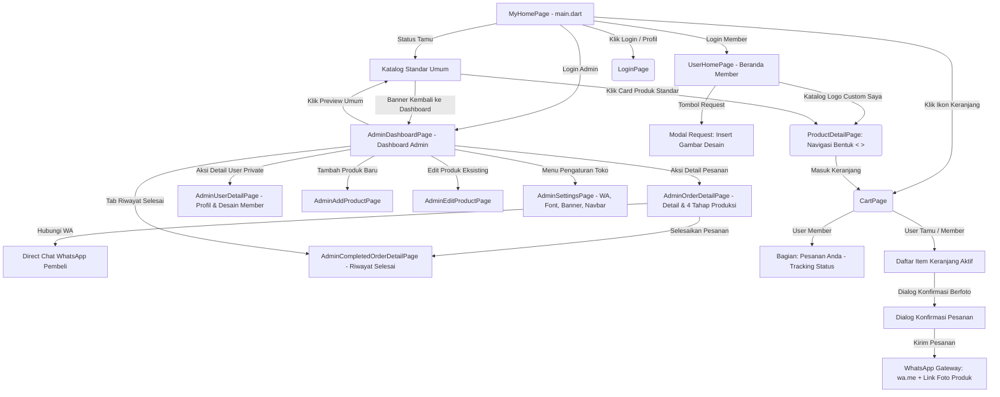

# 🎨 Arsitektur Antarmuka & Komponen UI (Frontend)

Dokumen ini mendokumentasikan secara rinci komponen-komponen antarmuka pengguna (UI), hierarki halaman, interaksi widget, dan service layer dalam aplikasi **Katalog**.

---

## 1. 📑 Rincian Halaman (Pages)

### A. `lib/main.dart` (`MyHomePage`)
- **Tanggung Jawab**: Menampilkan katalog utama produk untuk publik/tamu, search bar dinamis, grid produk sangkar, dan routing cerdas berdasarkan role autentikasi.
- **Fitur Utama**:
  - **Latar Belakang Warna Krem Hangat (*Warm Cream / Ivory* - `#F8F4EA`)**: Warna background resmi aplikasi yang menyatukan katalog umum dan katalog khusus dalam nuansa hangat, elegan, dan harmonis dengan kerajinan kayu jati (*teak wood*).
  - **Top Navigation Bar Responsif**: Dilengkapi emblem logo Jatimas Sangkar, pencarian instan, dan indikator badge angka belanjaan pada ikon keranjang.
  - **Hero Banner**: Header visual yang menampilkan keunggulan kerajinan sangkar jati pilihan.
  - **Grid Katalog Produk Seragam**: Ukuran kartu produk (katalog 1 s/d 5) diseragamkan tinggi dan rasio gambarnya dengan kartu berwarna putih di atas kanvas krem.
  - **Search Filter Dinamis**: Menyaring produk berdasarkan kecocokan nama dan kategori secara instan.
  - **Banner Mode Preview Admin**: Saat admin mengakses mode pratinjau publik ("Preview Umum"), banner khusus di bagian atas layar menyediakan tombol sekali klik "Kembali ke Dashboard".
  - **Transisi Halaman Instan**: Seluruh perpindahan halaman diatur tanpa animasi transisi (instant transition) untuk pengalaman navigasi yang cepat dan responsif.

### B. `lib/pages/admin_dashboard_page.dart` (`AdminDashboardPage`)
- **Tanggung Jawab**: Pusat kendali operasional terpadu bagi administrator (`Admin 1` / `admin@gmail.com`).
- **Fitur Utama**:
  - **Sidebar Navigasi Kayu Jati**:
    - Berwarna cokelat kayu jati pekat (`#382314`), lebar 220px dengan aksen emas (`#D4AF37`).
    - Logo emblem diperbesar (**62 × 62 px**) dengan border emas 2.0px dan tipografi *JATIMAS SANGKAR* serta badge *ADMIN PANEL*.
    - Menu aktif berlatar belakang kontras, serta tombol "Preview Umum" dan "Keluar" (Logout).
  - **Header Admin**:
    - Menampilkan kartu profil admin, status online, dan tombol aksi cepat.
  - **Analisis Data Metrik (Strict 2 Rows x 3 Columns)**:
    - **Baris 1**: `JUMLAH DESIGN PRODUK` (1.200), `JUMLAH PESANAN` (259), `JUMLAH DESIGN REQUEST` (12).
    - **Baris 2**: `JUMLAH BENTUK SANGKAR` (terhubung dinamis ke `CageService.cages.length`), `JUMLAH PESANAN BARU` (2), kolom ke-3 sengaja dikosongkan untuk keseimbangan tata letak visual.
    - Setiap kartu metrik memiliki garis penanda vertikal cokelat jati (`#8B5328`), tinggi 112px, dan angka tebal berukuran font 36.
  - **Tabel Pesanan Masuk (Elongated Table)**:
    - Wadah tabel memanjang (`minWidth: 1050`, tinggi baris 52, jarak kolom 42) dengan scrollbar horizontal.
    - Memuat kolom: *No*, *Nama*, *Desain*, *Bentuk*, *Kuantitas*, *Catatan*, *Status*, dan *Aksi*.
    - Tombol "Detail" membuka dialog pop-up interaktif rincian pesanan.
  - **Tabel User Private (Elongated Table)**:
    - Menampung pengajuan desain kustom member (*User Private*).
    - Wadah tabel memanjang (`minWidth: 1050`, tinggi baris 52, jarak kolom 46).
    - Memuat kolom: *No*, *Nama User*, *Nama Desain*, *Bentuk Sangkar*, *Deskripsi/Catatan*, *Tanggal*, dan *Aksi* (dialog preview gambar & spesifikasi desain).
  - **Section "List Produk User Umum"**:
    - Menampilkan katalog produk yang sedang tayang di sisi publik.
    - Header pencarian "Cari berdasarkan:" dengan tombol pill pilihan `Nama` (cokelat aktif) dan `Kode` (abu-abu), serta dua kolom input filter real-time (`.....` dan `...`).
    - Grid kartu produk berisi gambar thumbnail proporsional, nama produk (contoh: `A01-Batman Swing biru cantik`), dan tag produk (`#superhero #batman #DC`).
  - **Section "Sangkar" (Manajemen Varian Bentuk Sangkar Mandiri Database)**:
    - Terhubung langsung secara mandiri baris per baris ke tabel PostgreSQL `public.bentuk_sangkar` di Supabase.
    - **Sinkronisasi Instan & Pemuatan Otomatis**: Dipanggil otomatis saat startup aplikasi di `main()` dan saat `AdminDashboardPage` dibuka, dilengkapi indikator loading halus saat data sedang diambil.
    - Deretan kartu bentuk sangkar minimalis dan bersih (nama sangkar seperti *Bijian No.2 37x43 cm*, *Kosan R.10 40x40 cm*, dan tombol hapus `x`).
    - **Navigasi Multi-Input Lengkap**:
      - Tombol panah navigasi `<` dan `>` pada header section untuk memudahkan geser kiri/kanan.
      - **Dukungan Scroll Mouse Horisontal**: Dilengkapi pendeteksi event pointer wheel (`Listener.onPointerSignal`) yang mengonversi scroll vertikal roda mouse menjadi geseran horisontal secara mulus.
      - **Mouse Drag**: Mengaktifkan `PointerDeviceKind.mouse` dalam `ScrollConfiguration` sehingga admin dapat menggeser baris sangkar menggunakan drag kursor mouse di desktop dan web.
      - **Scrollbar Khusus**: Scrollbar horizontal dengan thumb selalu terlihat (`thumbVisibility: true`).
    - **Tombol "Tambah Sangkar" Cepat**:
      - Terletak di sudut kanan bawah section.
      - Membuka modal dialog ringkas: menginput nama bentuk sangkar baru, langsung tersimpan ke Supabase `bentuk_sangkar`, cache lokal `SharedPreferences`, dan cadangan storage.

### C. `lib/pages/product_detail_page.dart` (`ProductDetailPage`)
- **Tanggung Jawab**: Menyajikan detail lengkap mengenai sangkar burung yang dipilih pengguna dan konfigurasi pemesanan kustom.
- **Fitur Utama**:
  - **Tampilan Visual Produk Presisi**:
    - Kotak foto utama berukuran **tinggi 350 px**, warna latar abu-abu halus (`#B0B0B0`), kelengkungan sudut **`borderRadius: 18`**, dan bayangan lembut.
    - Menggunakan properti **`fit: BoxFit.contain`** dan `Product.buildImageFromSource` sehingga logo/artwork persegi (seperti *Es Durian Shake*), landscape, maupun portrait **tampil 100% utuh tanpa terpotong (no-crop)**.
    - Tampilan bersih tanpa kotak thumbnail duplikat di samping sangkar (nama/label langsung fokus pada variasi).
  - **Navigasi Bentuk Sangkar dengan Tombol Next & Previous**: Dilengkapi tombol panah kiri (`<`) dan kanan (`>`) di samping deretan bentuk sangkar dinamis dari `CageService` (`Bijian No.2`, `Kosan R.10`, `Sangkar isi 2`, dst.).
  - **Dukungan Foto Sangkar Spesifik per Produk**: Setiap produk dapat memiliki foto sangkar yang berbeda-beda untuk variasi ukuran yang sama (disimpan pada kolom `variasi` di data produk).
  - **Counter Kuantitas per Bentuk**: Tombol `+` dan `-` kuantitas yang tersimpan secara terpisah untuk setiap bentuk sangkar.
  - **Catatan Dinamis per Bentuk**: Kolom catatan (*note*) berada di posisi yang konsisten, namun isi teks note dan batasan kata tersimpan secara independen untuk setiap bentuk sangkar yang dipilih.
  - **Tombol Keranjang**: Menambahkan pesanan setiap bentuk sangkar yang memiliki kuantitas > 0 ke keranjang belanja secara terpisah.

### D. `lib/pages/cart_page.dart` (`CartPage`)
- **Tanggung Jawab**: Menampilkan daftar barang pesanan pembeli, seleksi item, kalkulasi harga, checkout WhatsApp dengan tautan foto produk, dan pelacakan pesanan.
- **Fitur Utama**:
  - **Bagian "Pesanan Anda" (Eksklusif Akun Member Login)**:
    - Khusus ditampilkan jika pengguna berstatus login sebagai Member.
    - Menampilkan daftar pesanan berjalan dari `OrderService` lengkap dengan status tahapan pengerjaan (*Tahap 1 Verifikasi & Desain* s/d *Tahap 4 Perakitan & Finishing*), nomor invoice, dan rincian item.
    - **Terisolasi dari Pengguna Tamu**: Bagian ini otomatis disembunyikan jika pengunjung adalah tamu/umum (guest).
  - **Pemisahan Item per Bentuk Sangkar**: Pesanan dengan bentuk sangkar berbeda otomatis dipisahkan menjadi kartu item tersendiri dengan badge `Bentuk: Sangkar X`.
  - **Kotak Catatan Khusus**: Menampilkan catatan kustom yang telah diinput pengguna pada masing-masing item.
  - **Penghapusan Responsif & Pembersihan Jejak Pesanan**: Tombol hapus ikon tempat sampah pada tiap item bekerja instan. Saat keranjang kosong, seluruh state pemesanan direset bersih.
  - **Checkbox Seleksi Item & Pilih Semua**: Pengguna dapat mencentang item tertentu yang ingin dibeli atau menggunakan tombol "Pilih Semua".
  - **Tombol Hapus Semua Dinamis**: Tombol "Hapus Semua" hanya muncul jika terdapat item yang dicentang.
  - **Dialog Konfirmasi Pesanan Berfoto**: Pop-up konfirmasi pesanan menampilkan thumbnail foto produk, rincian kuantitas, catatan, dan input nomor WhatsApp pemesan.
  - **Tombol Pesan WhatsApp Resmi di Kanan Bawah**:
    - Tombol berwarna hijau resmi WhatsApp (`#25D366`) berpadu dengan **Logo Resmi WhatsApp** (`WhatsAppLogo`).
    - **Otomatis Menyertakan Foto Produk**: Pesan WhatsApp yang dibuat via `AppSettingsService.createOrderWhatsAppUri` menyematkan nama produk, kuantitas, catatan, dan **URL foto produk** (`📸 Foto Produk: https://...`) yang memicu *rich link preview* gambar di aplikasi WhatsApp.
    - Mengarahkan pesanan langsung ke nomor WhatsApp Admin yang dikonfigurasi.

### E. `lib/pages/login_page.dart` (`LoginPage`)
- **Tanggung Jawab**: Formulir autentikasi pengguna dengan pemisahan akun member dan administrator.
- **Fitur Utama**:
  - Latar belakang foto sangkar di taman alam berpadu gradien zaitun-cokelat gelap elegan.
  - Header brand `JATIMAS SANGKAR` kuning emas.
  - Input Email dan Password dengan visibilitas toggle.
  - Tombol Masuk Supabase Auth.
  - Tombol Masuk Cepat (Mode Demo) & Dukungan Akun Admin (`admin@gmail.com`).

### F. `lib/pages/user_home_page.dart` (`UserHomePage`)
- **Tanggung Jawab**: Halaman beranda khusus untuk pengguna yang telah login (Member Jatimas Sangkar).
- **Fitur Utama**:
  - **Latar Belakang Warna Krem (*#F8F4EA*)**: Memiliki background krem yang seragam dengan katalog umum sehingga visual aplikasi terasa selaras dan menenangkan.
  - **Pemisahan Data Total**: Keranjang belanja dan katalog member dipisahkan 100% dari pengguna tamu (guest).
  - **Banner Ruang Kerja Member**: Banner gradien kayu jati elegan dengan ikon terverifikasi dan tombol beralih cepat ke "Katalog Umum".
  - **Tombol Request Logo Custom**: Tombol interaktif untuk mengajukan logo sangkar kustom baru.
  - **Form Request dengan Fitur Insert Gambar**: Menginput gambar referensi desain kustom pelanggan langsung dari galeri/file lokal.
  - **Katalog Beranda Khusus Logo Custom**: Grid kartu logo custom berlatar putih dengan border aksen amber halus di atas kanvas krem.

### G. `lib/pages/admin_order_detail_page.dart` (`AdminOrderDetailPage`)
- **Tanggung Jawab**: Menampilkan dan mengelola rincian pesanan masuk yang dibuat oleh pelanggan.
- **Fitur Utama**:
  - **Info Kontak & Direct WhatsApp**: Menampilkan nomor telepon pemesan beserta tombol "Hubungi WhatsApp" langsung (`https://wa.me/...`).
  - **Daftar Produk Pesanan**: Menampilkan kartu produk lengkap dengan foto thumbnail, nama variasi sangkar, kuantitas, dan catatan khusus dari pembeli.
  - **Kontrol 4 Tahapan Produksi**: Pilihan radio interaktif untuk 4 tahapan pengerjaan (*Tahap 1: Verifikasi & Desain*, *Tahap 2: Pemilihan Kayu Jati*, *Tahap 3: Proses Ukir & Grafir*, *Tahap 4: Perakitan & Finishing*).
  - **Tombol "Simpan Perubahan" & "Selesaikan Pesanan"**: Menyimpan progres pesanan ke `OrderService` atau memindahkan pesanan ke riwayat pesanan selesai.

### H. `lib/pages/admin_completed_order_detail_page.dart` (`AdminCompletedOrderDetailPage`)
- **Tanggung Jawab**: Menampilkan rincian pesanan yang telah diselesaikan (*Riwayat Pesanan*).
- **Fitur Utama**:
  - Menampilkan nomor pesanan, tanggal penyelesaian, nomor kontak pembeli, dan tombol hubungi WhatsApp.
  - Daftar produk dan spesifikasi bentuk sangkar yang telah diselesaikan.
  - Badge visual status hijau bertuliskan "Selesai".

### I. `lib/pages/admin_user_detail_page.dart` (`AdminUserDetailPage`)
- **Tanggung Jawab**: Menampilkan profil lengkap pelanggan private (*Member*).
- **Fitur Utama**:
  - Informasi kredensial (nama, email, no HP/WhatsApp, alamat).
  - Daftar desain logo custom yang diajukan oleh pengguna beserta tombol preview.
  - Katalog pratinjau produk kustom khusus user tersebut.

### J. `lib/pages/admin_add_product_page.dart` & `admin_edit_product_page.dart`
- **Tanggung Jawab**: Menambah produk baru ke katalog publik atau menyunting detail produk yang sudah ada.
- **Fitur Utama**:
  - Input nama produk, kategori, harga, kode produk, tagar (#), dan URL gambar.
  - **Sinkronisasi Bentuk Sangkar**: Mengintegrasikan pilihan variasi bentuk sangkar (`ProductCageVariation`) dengan foto kustom yang tersinkronisasi dua arah ke `CageService`.

### K. `lib/pages/admin_settings_page.dart` (`AdminSettingsPage`)
- **Tanggung Jawab**: Pusat pengaturan konfigurasi toko dan tampilan katalog oleh Admin.
- **Fitur Utama**:
  - **Nomor WhatsApp Tujuan Pesanan**: Mengatur nomor WhatsApp Admin penerima seluruh pesanan publik dan member.
  - **Banner Katalog Kustom**: Pilihan sampel banner siap pakai atau input URL gambar banner kustom.
  - **Layout Navbar**: Pilihan 3 variasi tata letak Top Navbar katalog umum (Style 1, Style 2, Style 3).
  - **Jenis Font Katalog**: Pilihan tipografi (`Times New Roman`, `Outfit`, `Poppins`, `Roboto`, `Playfair Display`).

---

## 2. 🧩 Lapisan Layanan Terpusat (Service Layer)

| Service | File | Peran & Tanggung Jawab |
| :--- | :--- | :--- |
| `AuthService` | `lib/services/auth_service.dart` | Mengelola status login, identitas pengguna, dan pemisahan role antara Tamu (*Guest*), Member (`davin@gmail.com`), dan Admin (`admin@gmail.com` / `Admin 1`). |
| `CageService` | `lib/services/cage_service.dart` | State manager berbasis `ChangeNotifier` yang mengelola variasi bentuk sangkar secara mandiri baris per baris ke tabel PostgreSQL `public.bentuk_sangkar`, cache offline instan `SharedPreferences`, dan cadangan storage. Dipanggil otomatis pada startup aplikasi dan saat admin dashboard dibuka. |
| `OrderService` | `lib/services/order_service.dart` | Mengelola antrean pesanan masuk (`incomingOrders`), riwayat pesanan selesai (`completedOrders`), update 4 tahapan produksi custom, dan pelacakan pesanan aktif member di keranjang. |
| `ProductService` | `lib/services/product_service.dart` | Mengelola data katalog produk umum secara reaktif (`ChangeNotifier`), sinkronisasi tambah/edit produk admin ke katalog publik. |
| `AppSettingsService` | `lib/services/settings_service.dart` | Mengelola nomor WhatsApp tujuan pesanan (`adminWhatsApp`), banner kustom, style navbar (1-3), font katalog, pembentukan link pesanan WhatsApp berfoto, serta penyedia logo terpadu (`buildLogoWidget`) yang dioptimasi dengan varian resolusi (1.0x, 2.0x, 3.0x), auto downsampling `cacheWidth`/`cacheHeight`, dan anti-aliasing `FilterQuality.medium`. |

---

## 3. 🧩 Komponen Reusable (Widgets)

| Widget | File | Fungsi & Penggunaan |
| :--- | :--- | :--- |
| `TopNavbar` | `widgets/top_navbar.dart` | Bilah navigasi atas yang memuat emblem logo lingkaran 44px bersanding dengan teks merek elegan `JATIMAS SANGKAR` (kombinasi putih tebal & kuning emas), search input dinamis, ikon keranjang belanja dengan badge counter, dan tombol profil/login. |
| `HeroBanner` | `widgets/hero_banner.dart` | Banner visual di bagian atas halaman katalog untuk memperkuat identitas brand Jatimas Sangkar, mendukung gambar bawaan maupun banner kustom admin. |
| `WhatsAppLogo` | `pages/cart_page.dart` | Komponen logo resmi WhatsApp berbasis Base64 memory image untuk tombol Pesan. |
| `WhatsAppIcon` | `pages/admin_order_detail_page.dart` | Komponen ikon WhatsApp presisi berbasis CustomPainter untuk tombol hubungi pembeli di halaman admin. |

---

## 4. 📐 Hierarki Tampilan & Navigasi (Navigation Graph)

