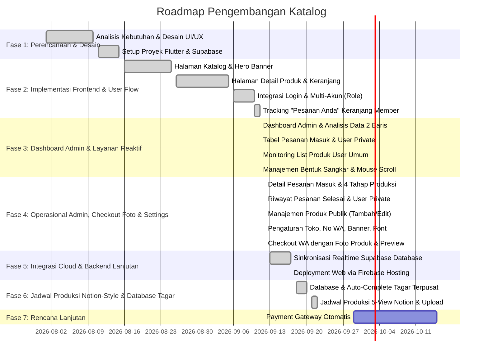

# 📋 Perencanaan Proyek (Project Planning)

Dokumen ini memuat visi, tujuan, cakupan, dan roadmap pengembangan aplikasi **Katalog**.

---

## 1. 🎯 Latar Belakang & Tujuan

Aplikasi Katalog ini dirancang untuk memudahkan promosi dan pemesanan produk sangkar burung kerajinan jati (Jatimas Sangkar) secara digital. Aplikasi ini mempermudah pembeli dalam menelusuri katalog produk, melihat detail spesifikasi, memasukkan barang ke keranjang belanja, memantau status pesanan (bagi member), hingga manajemen operasional terpadu bagi administrator (analisis data, pesanan masuk, request desain kustom, dan penambahan bentuk sangkar).

### Tujuan Utama:
1. Menyajikan katalog produk kerajinan sangkar jati secara interaktif, proporsional, dan responsif.
2. Memfasilitasi pencarian dan pemfilteran produk berdasarkan kategori, nama, dan kode.
3. Memberikan pengalaman pemesanan yang mudah melalui sistem keranjang belanja independen untuk tamu dan member.
4. Menyediakan pelacakan status "Pesanan Anda" bagi pengguna terdaftar (member).
5. Menyediakan Dashboard Administrator terpadu untuk monitoring metrik, pesanan, request pengguna, dan manajemen bentuk sangkar secara real-time.
6. Menyediakan sistem login/autentikasi dengan pemisahan peran (*role-based*) yang terintegrasi dengan database cloud Supabase.

---

## 2. 👥 Target Pengguna

1. **Konsumen Tamu (Guest)**: Masyarakat umum dan penggemar burung berkicau yang menjelajahi katalog publik dan memesan langsung via WhatsApp tanpa perlu login.
2. **Member / Pengguna Terdaftar**: Pelanggan setia yang memiliki akun, dapat mengajukan desain logo custom (*Insert Gambar*), mengelola katalog kustom pribadi, dan melacak proses pengerjaan pesanannya melalui menu "Pesanan Anda".
3. **Administrator / Pengelola**: Pengelola Jatimas Sangkar (`admin@gmail.com`) yang memantau metrik performa toko, meninjau rincian pesanan masuk, memproses pengajuan desain private, memonitor daftar produk publik, dan menambah varian bentuk sangkar secara reaktif.

---

## 3. 🗺️ Roadmap Pengembangan

---

## 4. 📊 Kebutuhan Fitur (Feature Backlog)

### A. Fitur Prioritas Tinggi (High Priority) — *Selesai*
- [x] Katalog produk dengan ukuran thumbnail, nama, kategori, dan harga berformat Rupiah yang seragam.
- [x] Fitur pencarian produk berbasis query teks secara real-time.
- [x] Detail produk interaktif dengan varian bentuk sangkar, tombol navigasi panah `<` dan `>`, serta kolom catatan independen per bentuk.
- [x] Keranjang belanja responsif (pemisahan per bentuk sangkar, checkbox item, pilih semua, hapus dinamis, reset jejak state).
- [x] Tombol "Pesan" di kanan bawah berbalut warna dan Logo Resmi WhatsApp (Base64 memory byte) yang terhubung ke pesan WhatsApp.
- [x] **Checkout WhatsApp dengan Foto Produk**: Format pesan WhatsApp pesanan kini otomatis menyertakan tautan foto produk (`📸 Foto Produk: https://...`) atau foto varian sangkar, serta pratinjau thumbnail foto di dialog konfirmasi pesanan.
- [x] Halaman login pengguna bertema Jatimas Sangkar (Supabase Auth & Mode Demo).
- [x] Pemisahan data total antara pengguna tamu (guest) dan member login (keranjang & katalog terpisah).
- [x] Halaman beranda khusus member dengan katalog logo custom & form request sangkar fitur **Insert Gambar**.
- [x] Fitur "Pesanan Anda" di halaman keranjang belanja khusus akun member untuk pemantauan progres pengerjaan pesanan.
- [x] Pemisahan Akun Admin (`admin@gmail.com` / `Admin 1`) dan halaman `AdminDashboardPage`.
- [x] Analisis data metrik dalam susunan kisi presisi 2 baris x 3 kolom dengan strip vertikal cokelat jati.
- [x] Tabel Pesanan Masuk dan User Private memanjang dengan tombol pop-up rincian detail.
- [x] **Detail Pesanan Masuk Admin (`AdminOrderDetailPage`)**: Menampilkan kontak pembeli, direct chat WhatsApp, detail produk & bentuk sangkar, pemilihan 4 tahapan produksi custom (Verifikasi Desain, Kayu Jati, Ukir/Grafir, Perakitan/Finishing), dan tombol selesaikan pesanan.
- [x] **Riwayat Pesanan Selesai (`AdminCompletedOrderDetailPage`)**: Halaman riwayat pesanan yang sudah rampung dengan tanggal selesai dan riwayat kontak pembeli.
- [x] **Detail User Private (`AdminUserDetailPage`)**: Rincian profil member, kredensial akun, riwayat logo custom, dan pratinjau katalog khusus member.
- [x] **Tambah & Edit Produk Publik Admin (`AdminAddProductPage` & `AdminEditProductPage`)**: Menambah dan mengubah produk katalog umum beserta sinkronisasi bentuk sangkar dan gambar.
- [x] **Pengaturan Toko Admin (`AdminSettingsPage` & `AppSettingsService`)**: Mengatur nomor WhatsApp tujuan seluruh pesanan, pilihan banner katalog umum, layout navbar (Style 1-3), dan font katalog.
- [x] Bagian "List Produk User Umum" di dashboard admin dengan pencarian berdasarkan Nama/Kode.
- [x] **Sinkronisasi Supabase Database 6 Tabel Inti Aktif**: Produk publik (`produk`), katalog kustom (`produk_custom`), user private (`user_private`), pesanan 4 tahap (`pesanan`), master bentuk sangkar mandiri (`bentuk_sangkar`), dan pengaturan toko (`app_settings`).
- [x] **Master Bentuk Sangkar Relasional Mandiri (`public.bentuk_sangkar`)**: Variasi bentuk sangkar dikelola mandiri baris per baris di database Supabase dengan sinkronisasi startup otomatis, loading state halus, dan cache lokal `SharedPreferences`.
- [x] **Peremajaan Tema Warna Krem Hangat (*Warm Cream / Ivory* - `#F8F4EA`)**: Mengubah background katalog umum dan katalog khusus menjadi warna krem hangat yang estetik dan selaras dengan kayu jati Jepara.
- [x] **Cloud Storage Pengaturan Toko**: Konfigurasi global admin disimpan langsung pada tabel `app_settings` dan file cadangan `app_settings.json` di bucket Supabase Storage `katalog`.
- [x] **Hosting Web Otomatis**: Integrasi konfigurasi hosting `firebase.json` untuk rilis Flutter Web ke Firebase Hosting.
- [x] **Jadwal Produksi Multi-View Notion-Style (`ScheduleProductionPage`)**: Pengelolaan jadwal produksi komprehensif dengan 5 mode tampilan (*Bulanan*, *Mingguan*, *Gallery*, *Board/Kanban*, *Table*) yang mereplikasi referensi `https://jatimas.beelink.web.id/`.
- [x] **Upload Gambar Perangkat & Validasi Wajib**: Fitur pemilihan gambar langsung dari galeri smartphone atau file browser komputer via `image_picker` + Supabase Storage (`StorageService`), live preview card interaktif, dan validasi wajib (*mandatory image*) saat menyimpan jadwal.
- [x] **Tata Letak Rata Kiri Konsisten**: Standardisasi struktur antarmuka jadwal produksi menggunakan `crossAxisAlignment: CrossAxisAlignment.stretch`, container full-width (`width: double.infinity`), dan `Align(alignment: Alignment.topLeft)`.
- [x] **Database & Auto-Complete Tagar Terpusat (`HashtagService` & `HashtagAutocompleteField`)**: Kamus tagar terpusat di `public.hashtags` dengan pencarian auto-complete cerdas saat pengetikan di form admin dan pemanenan tagar baru secara otomatis.
- [x] **Penyegaran Tampilan Detail Produk Bersih**: Menghilangkan bintang rating dan label ulasan dari `ProductDetailPage` agar tampilan katalog tetap bersih, elegan, dan fokus pada keunggulan spesifikasi sangkar jati.

### B. Fitur Prioritas Menengah (Medium Priority)
- [x] Sinkronisasi otomatis daftar produk langsung dari database Supabase (`produk` table).
- [x] Integrasi pemesanan WhatsApp lengkap dengan format rincian produk, tautan foto produk, bentuk sangkar, dan catatan pemesan.
- [x] Manajemen state terpusat via Service Layer (`AuthService`, `CageService`, `OrderService`, `ProductService`, `AppSettingsService`, `ProductionScheduleService`, `HashtagService`, `StorageService`).
- [ ] Integrasi Supabase Auth penuh (Register akun mandiri, Forgot Password, OAuth Google).

### C. Fitur Prioritas Rendah (Future Enhancements)
- [ ] Integrasi Payment Gateway (Midtrans / Xendit).
- [ ] Review dan rating produk langsung oleh pembeli terverifikasi.
- [ ] Ekspor laporan pesanan admin ke format PDF / Excel.

---

## 🔗 Dokumen Terkait
- [Spesifikasi Teknis & Alur Sistem (SRS)](./spesifikasi_projek.md)
