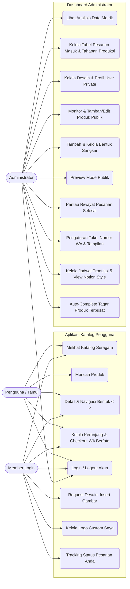

# 📄 Spesifikasi Kebutuhan Sistem (System Requirements Specification)

Dokumen ini mendefinisikan kebutuhan fungsional, non-fungsional, use case, dan batasan teknis aplikasi **Katalog**.

---

## 1. 🔍 Kebutuhan Fungsional (Functional Requirements)

| Kode | Nama Fitur | Deskripsi |
| :--- | :--- | :--- |
| **FR-01** | Eksplorasi Katalog Seragam | Pengguna dapat melihat daftar seluruh produk sangkar jati dengan ukuran kartu, rasio gambar, nama, dan harga berformat Rupiah yang seragam dan rapi. |
| **FR-02** | Pencarian Produk | Pengguna dapat mencari produk dengan mengetikkan kata kunci pada search bar secara instan. |
| **FR-03** | Detail Produk & Navigasi Bentuk | Pengguna dapat melihat spesifikasi lengkap, memilih varian bentuk sangkar dengan tombol panah Previous (`<`) dan Next (`>`), serta menulis catatan terpisah untuk setiap bentuk sangkar. |
| **FR-04** | Keranjang Belanja & Pesan WhatsApp | Pengguna dapat memilih item menggunakan checkbox / Pilih Semua, menghapus item terpilih secara responsif tanpa meninggalkan jejak/state semu, dan menekan tombol Pesan berlogo resmi WhatsApp untuk menyelesaikan pesanan. |
| **FR-05** | Autentikasi Pengguna & Pemisahan Role | Pengguna dapat masuk (Login) menggunakan kredensial email dan kata sandi. Sistem mengenali role Akun Pengguna Biasa/Member (`davin@gmail.com`) dan Akun Administrator (`admin@gmail.com`). |
| **FR-06** | Sinkronisasi Supabase | Data autentikasi dan produk terhubung dengan basis data cloud Supabase. |
| **FR-07** | Pemisahan Data Tamu & Member | Data keranjang belanja dan preferensi katalog antara pengguna belum login (guest) dan member login dipisahkan 100% secara independen. |
| **FR-08** | Request & Katalog Logo Custom Member | Pengguna login memiliki halaman beranda tersendiri dengan tombol request yang dilengkapi fitur **Insert Gambar** desain dan katalog beranda yang khusus memuat logo custom buatan user tersebut. |
| **FR-09** | Transisi Antarmuka Instan | Seluruh perpindahan halaman berjalan cepat tanpa animasi transisi (instant navigation) untuk efisiensi dan responsivitas interaksi. |
| **FR-10** | Tracking "Pesanan Anda" di Keranjang | Pengguna login (Member) dapat memantau status pesanan yang sedang berjalan (*Menunggu Konfirmasi*, *Sedang Diproses*, *Selesai*) di halaman keranjang belanja. Bagian ini secara eksklusif disembunyikan dari pengguna tamu/umum. |
| **FR-11** | Dashboard Administrator Terpadu | Halaman khusus admin (`AdminDashboardPage`) dengan sidebar bertema kayu jati Jepara (`#382314`), header informasi admin, tombol pratinjau publik (*Preview Umum*), dan tombol kembali ke dashboard. |
| **FR-12** | Analisis Data Metrik Real-time | Dashboard admin menampilkan ringkasan metrik dalam tata letak kisi 2 baris x 3 kolom yang presisi: *Jumlah Design Produk*, *Jumlah Pesanan*, *Jumlah Design Request*, *Jumlah Bentuk Sangkar* (terhubung langsung ke jumlah aktif sangkar), dan *Jumlah Pesanan Baru*. |
| **FR-13** | Tabel Pesanan Masuk & User Private | Tabel admin memuat daftar pesanan masuk dan pengajuan desain kustom (*User Private*) dengan layout kotak memanjang, kolom lengkap, status visual, serta pop-up dialog detail interaktif. |
| **FR-14** | Monitoring List Produk User Umum di Admin | Dashboard admin memuat tampilan list produk katalog umum yang dilengkapi pencarian berbasis pilihan *Nama* / *Kode* dan input dinamis untuk memonitor tampilan dari sudut pandang pembeli. |
| **FR-15** | Manajemen Bentuk Sangkar Reaktif & Ringkas | Admin dapat menambah bentuk sangkar baru secara cepat tanpa input foto/link (cukup nama sangkar). Kartu bentuk sangkar di dashboard tampil bersih tanpa thumbnail foto (ikon + nama + tombol hapus x), dilengkapi navigasi panah `<` & `>`, scrolling roda mouse horizontal, mouse drag, dan auto-scroll otomatis ke item baru. |
| **FR-16** | Checkout WhatsApp dengan Foto Produk & Link Preview | Sistem secara otomatis menyertakan URL foto produk (`📸 Foto Produk: https://...`) atau foto variasi sangkar dalam format pesan pesanan WhatsApp, memunculkan pratinjau thumbnail pada dialog konfirmasi keranjang, dan mengarahkan pesan langsung ke nomor WhatsApp Admin yang terkonfigurasi. |
| **FR-17** | Pengaturan Toko & WhatsApp Tujuan Admin | Admin dapat mengonfigurasi nomor WhatsApp tujuan pesanan (`AppSettingsService`), pilihan banner katalog umum, variasi layout navbar (Style 1-3), serta jenis font katalog (`Times New Roman`, `Outfit`, `Poppins`, `Roboto`, `Playfair Display`) melalui halaman `AdminSettingsPage`. |
| **FR-18** | Detail Pesanan Masuk & Kontrol 4 Tahap Produksi | Admin dapat membuka rincian pesanan masuk (`AdminOrderDetailPage`), menghubungi pembeli melalui tombol direct WhatsApp, memilih 4 tahapan produksi custom (Tahap 1 Verifikasi & Desain s/d Tahap 4 Perakitan & Finishing), dan memindahkan pesanan ke status selesai. |
| **FR-19** | Riwayat Pesanan Selesai Admin | Admin dapat memantau daftar dan rincian pesanan yang telah rampung (`AdminCompletedOrderDetailPage`) lengkap dengan tanggal penyelesaian, ringkasan produk, dan kontak pembeli. |
| **FR-20** | Manajemen & Detail User Private | Admin dapat melihat profil lengkap member (*User Private*), kredensial akun, riwayat logo custom yang diajukan, serta pratinjau katalog kustom member melalui `AdminUserDetailPage`. |
| **FR-21** | Tambah & Edit Produk Publik Admin | Admin dapat menambah produk baru (`AdminAddProductPage`) atau menyunting produk eksisting (`AdminEditProductPage`) dengan foto, harga, deskripsi, tagar, dan variasi bentuk sangkar yang tersinkronisasi dua arah dengan `CageService`. |
| **FR-22** | Brand Identity & Tampilan Foto Anti-Crop | Logo brand transparan (`logo.png`) dilengkapi varian multi-resolusi (1.0x, 2.0x, 3.0x), auto downsampling cache di `AppSettingsService`, teks *JATIMAS SANGKAR* pada TopNavbar, serta wadah foto utama produk presisi 350px berproperti `BoxFit.contain` pada detail user maupun admin agar desain/logo tidak terpotong (*no-crop*). |
| **FR-23** | Master Varian Bentuk Sangkar Relasional | Pengelolaan varian bentuk sangkar terhubung langsung secara mandiri baris per baris ke tabel database PostgreSQL `public.bentuk_sangkar` di Supabase, dengan persistensi lokal `SharedPreferences`, sinkronisasi otomatis saat startup, dan navigasi panah geser `<` / `>`. |
| **FR-24** | Tema Latar Belakang Warna Krem Hangat | Seluruh antarmuka Katalog Umum dan Katalog Khusus mengadopsi latar belakang warna krem hangat (*Warm Cream / Ivory* - `#F8F4EA`) untuk kenyamanan visual dan keselarasan estetika dengan ukiran kayu jati Jepara. |
| **FR-25** | Jadwal Produksi Multi-View Notion-Style & Upload Perangkat | Pengelolaan jadwal proses produksi terpadu dengan 5 mode tampilan (*Bulanan*, *Mingguan*, *Gallery*, *Board*, *Table*) yang meniru referensi `https://jatimas.beelink.web.id/`. Seluruh tampilan mengadopsi tata letak rata kiri konsisten (*left-aligned* full-width), mendukung pemilihan file gambar langsung dari memori komputer/laptop atau galeri smartphone pengguna via `image_picker` + Supabase Storage (`StorageService`), pratinjau foto interaktif, serta validasi wajib (*mandatory*) di mana formulir tidak dapat disimpan jika foto belum diunggah. |
| **FR-26** | Database & Auto-Complete Tagar Terpusat | Pengelolaan tagar (#) terintegrasi ke database terpusat (`public.hashtags`) melalui `HashtagService`. Saat admin menambah atau menyunting produk di `AdminAddProductPage` / `AdminEditProductPage`, komponen `HashtagAutocompleteField` secara otomatis menampilkan daftar rekomendasi tagar relevan yang sudah ada saat mengetik `#`, menghindarkan pengetikan berulang, serta memanen tagar baru secara otomatis ke database. |

---

## 2. ⚡ Kebutuhan Non-Fungsional (Non-Functional Requirements)

| Aspek | Spesifikasi |
| :--- | :--- |
| **Performa** | Aplikasi dapat melakukan rendering UI pada 60 fps secara halus di perangkat mobile maupun desktop, dengan transisi instan antar layar. |
| **Keandalan Aset (Reliability)** | Aset brand penting seperti logo WhatsApp di-embed langsung ke memori (Base64) sehingga 100% bebas dari risiko kegagalan muat (asset load/cache error). Pemuatan gambar jadwal produksi didukung universal renderer `buildScheduleImage` yang tangguh memuat URL Supabase, Web HTTPS, Base64 URI, dan Asset lokal. |
| **Interaksi Scrolling Desktop & Web** | Komponen horizontal scrolling (seperti baris bentuk sangkar) mendukung scroll mouse-wheel vertikal yang dikonversikan menjadi pergeseran horizontal, tombol panah `<` dan `>`, serta mouse drag (`PointerDeviceKind.mouse`) agar tidak macet di layar desktop. |
| **Kompatibilitas** | Mendukung multiplatform: Android (API 21+), iOS, Web (Chrome, Firefox, Safari, Edge), Windows Desktop. |
| **Desain Antarmuka (UI/UX)** | Menggunakan Material Design 3 bernuansa kayu jati Jepara (*Teakwood* `#382314`, `#7A4B29`, `#8B5328`), latar belakang krem hangat (*Warm Cream* `#F8F4EA`), kartu proporsional seragam, pill-shaped button, dan responsif terhadap variasi ukuran layar. |
| **Keamanan & Otorisasi** | Pemisahan hak akses antara akun tamu (guest), member (`UserHomePage`), dan administrator (`AdminDashboardPage`). Token JWT melalui Supabase Auth serta penerapan Row Level Security (RLS) pada database. |

---

## 3. 🔄 Diagram Use Case



---

## 4. 🔀 Alur Pengguna (User Flow)

```mermaid
stateDiagram-v2
    [*] --> BukaAplikasi
    BukaAplikasi --> HalamanUtamaTamu : Belum Login / Tamu
    BukaAplikasi --> HalamanMember : Login sebagai Member
    BukaAplikasi --> DashboardAdmin : Login sebagai Admin
    
    state HalamanUtamaTamu {
        KatalogUmum --> CariProduk
        KatalogUmum --> DetailProduk : Klik Card
        DetailProduk --> NavigasiBentuk : Tombol < dan >
        NavigasiBentuk --> MasukKeranjangTamu : Tentukan Qty & Catatan
    }

    state HalamanMember {
        KatalogLogoCustomSaya --> RequestLogoCustom : Tombol Request
        RequestLogoCustom --> UnggahGambarDesain : Fitur Insert Gambar
        KatalogLogoCustomSaya --> DetailLogoCustom : Klik Card
        DetailLogoCustom --> MasukKeranjangMember : Tentukan Qty & Catatan
    }

    state DashboardAdmin {
        PantauAnalisisData --> CekPesananMasuk : Buka Detail Pesanan
        CekPesananMasuk --> HubungiWhatsAppPembeli : Direct Chat WA
        CekPesananMasuk --> UbahTahapanProduksi : 4 Tahapan Custom
        UbahTahapanProduksi --> SelesaikanPesanan : Pindah ke Riwayat Selesai
        PantauAnalisisData --> CekUserPrivate : Detail Profil & Logo Member
        PantauAnalisisData --> CekRiwayatSelesai : Riwayat Pesanan
        PantauAnalisisData --> PengaturanToko : Nomor WA, Font, Banner, Navbar
        PantauAnalisisData --> JadwalProduksi : Buka Jadwal Proses Pembuatan
        JadwalProduksi --> MultiViewNotion : Pilih Bulanan, Mingguan, Gallery, Board, Table
        MultiViewNotion --> UnggahFotoWajib : Upload Foto dari Laptop/HP (Mandatory)
        CariListProdukUmum --> TambahEditProduk : Form Tambah/Edit Produk
        TambahEditProduk --> AutoCompleteTagar : Rekomendasi Tagar Terpusat
        CariListProdukUmum --> TambahBentukSangkar : Form Dialog & Auto Scroll
        TambahBentukSangkar --> PreviewUmum : Mode Pratinjau Publik
        PreviewUmum --> KembaliKeDashboard : Banner Kembali
    }

    MasukKeranjangTamu --> HalamanKeranjang : Buka Keranjang
    MasukKeranjangMember --> HalamanKeranjang : Buka Keranjang
    
    state HalamanKeranjang {
        HalamanKeranjang --> TrackingPesananAnda : Khusus Member
        CentangCheckboxItem --> HapusItemTerpilih : Tombol Hapus Semua
        CentangCheckboxItem --> DialogKonfirmasi : Tombol Pesan WA
        DialogKonfirmasi --> KirimPesananWhatsApp : Thumbnail Foto Produk & Input No HP
    }

    KirimPesananWhatsApp --> ChatWhatsAppAdmin : Link Pesan + Foto Produk (wa.me)
    ChatWhatsAppAdmin --> [*]
```
